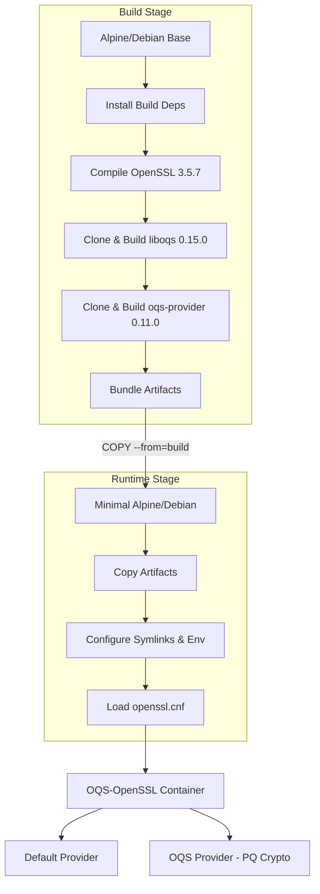

<div align="center">

# OQS-OpenSSL Container

OpenSSL 3.5.x docker images with the Open Quantum Safe (OQS) provider for post-quantum cryptography support

[](https://www.docker.com/)
[](https://www.openssl.org/)
[](https://github.com/open-quantum-safe/liboqs)
[](https://github.com/open-quantum-safe/oqs-provider)
[](LICENSE)

</div>

## Overview

OQS-OpenSSL Container provides pre-built Docker images with OpenSSL compiled from source and integrated with the Open Quantum Safe (OQS) provider. This enables immediate use of post-quantum cryptographic algorithms including:

- **Key Encapsulation Mechanisms (KEM)**: ML-KEM (Kyber), FrodoKEM, BIKE, HQC, NTRU, NTRU-Prime, Classic McEliece
- **Signature Schemes**: ML-DSA (Dilithium), SLH-DSA (SPHINCS+), Falcon, MAYO, CROSS, SNOVA, UOV, MQOM
- **Stateful Signatures**: LMS (XMSS), XMSS

Technology Stack:

- **OpenSSL** — Industry-standard cryptographic library with TLS/SSL implementation
- **liboqs** — Open source C library for quantum-safe cryptographic algorithms from the Open Quantum Safe project
- **oqs-provider** — OpenSSL 3 provider enabling post-quantum algorithms via the provider interface

### Architecture



### Supported Base Images

| Base OS              | Image Tag                     | Platform Support         |
| -------------------- | ----------------------------- | ------------------------ |
| Alpine Linux 3.21    | `oqs-openssl:alpine-latest`   | linux/amd64, linux/arm64 |
| Debian Bookworm slim | `oqs-openssl:bookworm-latest` | linux/amd64, linux/arm64 |

## Usage

### 1. Clone the repository

```bash
git clone https://github.com/Mournweiss/oqs-openssl-container.git
cd oqs-openssl-container
```

### 2. Build the image

```bash
chmod +x build.sh

./build.sh
```

#### Build Arguments

| Argument                   | Description                                    | Default                 |
| -------------------------- | ---------------------------------------------- | ----------------------- |
| `--base BASE`              | Base OS: `alpine`, `debian-bookworm`, or `all` | `alpine`                |
| `--tag TAG`                | Image tag                                      | `oqs-openssl:latest`    |
| `--context DIR`            | Build context directory                        | `.` (current directory) |
| `--openssl-version V`      | OpenSSL version to build                       | `3.5.7`                 |
| `--liboqs-version V`       | liboqs version to build                        | `0.15.0`                |
| `--oqs-provider-version V` | oqs-provider version to build                  | `0.11.0`                |
| `--test`                   | Enable auto-testing after build                | enabled                 |
| `--no-test`                | Disable auto-testing after build               | disabled                |
| `--help`, `-h`             | Show help message                              | —                       |

## License

This project is distributed under the **Apache License, Version 2.0**. See the [LICENSE](LICENSE) and [NOTICE](NOTICE) files for details.

### Component Licenses

| Component        | License            | Source                                                                                                               |
| ---------------- | ------------------ | -------------------------------------------------------------------------------------------------------------------- |
| **OpenSSL**      | Apache License 2.0 | [openssl-library.org](https://www.openssl.org/source/license.html)                                                   |
| **liboqs**       | MIT License        | [github.com/open-quantum-safe/liboqs](https://github.com/open-quantum-safe/liboqs/blob/main/LICENSE.txt)             |
| **oqs-provider** | MIT License        | [github.com/open-quantum-safe/oqs-provider](https://github.com/open-quantum-safe/oqs-provider/blob/main/LICENSE.txt) |
| **Alpine Linux** | MIT License        | [alpinelinux.org](https://alpinelinux.org/about/)                                                                    |
| **Debian**       | GPL, BSD, etc.     | [debian.org/legal/licenses](https://www.debian.org/legal/licenses)                                                   |
